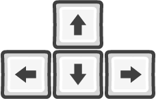
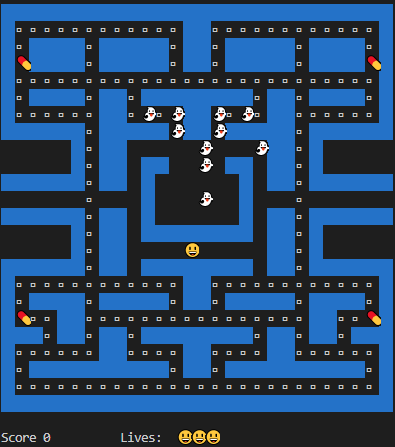
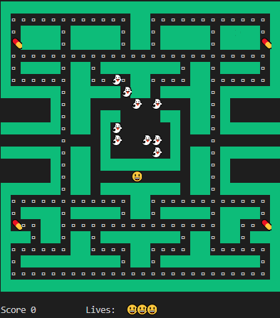
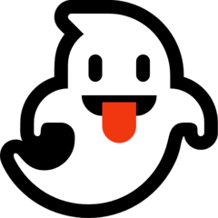
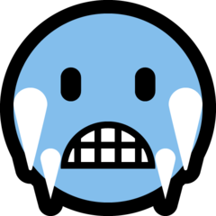

# Pacman

This is the classic pacman game, you will have 3 attemps to eat all the dots in the maze, just take care to be careful not to die when a ghost touch you. Remeber that the difficulty will depend on the number of ghosts selected,  and don't  forget to use the power up pills to eat some ghost and get some extra  points in your score.

To run the game you willneed just to have installed Go and to run the command: `make run` ; to end the game in any moment just click the `ESC` key on the keyboard

## The Pacman:

* To play the game you will move pacman thorugh the maze with the following Keyboard arrows

## The maze:

|Blue Maze 	|Green Maze	|
|-----------|-----------|
 | 

## The Ghosts:

At the initial menu of the game you can choose between 1 to 12 ghost enemies.

|Ghost 		|Blue Ghost	|
|-----------|-----------|
|

When you eat a pill, all the ghost will turn in to a Blue Ghost and you will be able to eat one in the next 10 seconds.

## Extra objects:

|Pills		| Dots - Walls|
|-----------|-----------|
||
	
	
**Have fun!!!**
